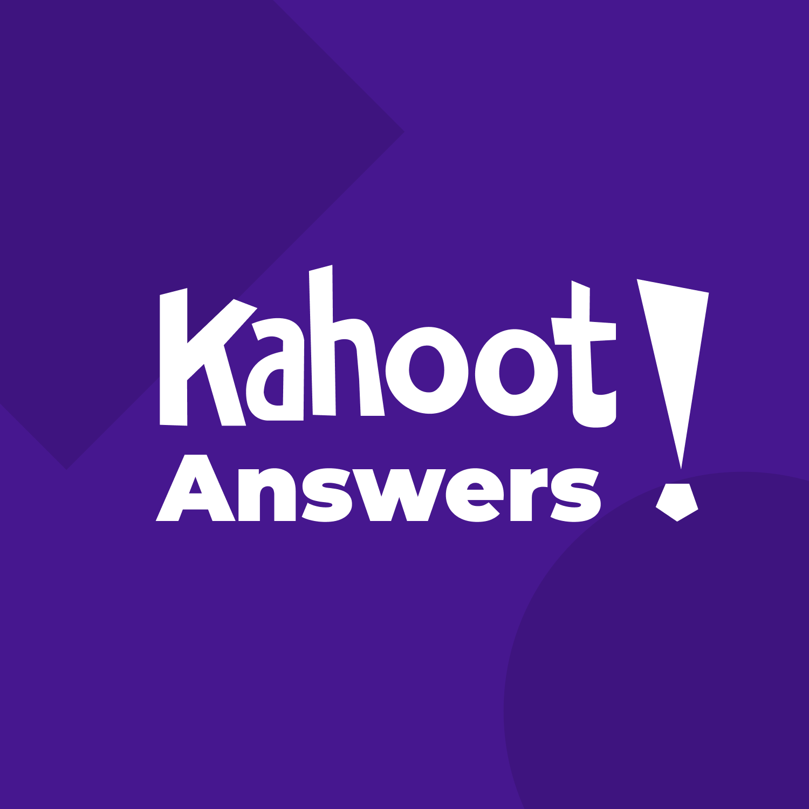

# Kahoot Answers #

Link: **https://khanswers.vercel.app**

It just sends get request to the one of API urls below and formats json response in html code. You can enter pin, id and any of gui urls. It can't be traced by your teacher and works for all quizes. 

PS: Code isn't really great, pull requests would be welcome

## TODO ## 
- [ ] Users block
- [ ] About info
- [ ] Support of question and answer styling

## Test kahoot quiz ##
Pin: 04442638  
Uuid: 6e342965-8e19-47ed-8f27-5707b03d8797  
Url id: 6e342965-8e19-47ed-8f27-5707b03d8797_1664805379662  
CreatorId: 6e342965-8e19-47ed-8f27-5707b03d8797  
Created: 1664805379662

### GUI urls ### 
 * https://kahoot.it/challenge/04442638?challenge-id=6e342965-8e19-47ed-8f27-5707b03d8797_1664805379662
 * https://kahoot.it/challenge/04442638
 * https://kahoot.it/challenge/6e342965-8e19-47ed-8f27-5707b03d8797_1664805379662

### API urls ###
 * https://kahoot.it/rest/challenges/6e342965-8e19-47ed-8f27-5707b03d8797_1664805379662
 * https://kahoot.it/rest/challenges/6e342965-8e19-47ed-8f27-5707b03d8797_1664805379662/answers
 * https://kahoot.it/rest/challenges/6e342965-8e19-47ed-8f27-5707b03d8797_1664805379662/progress
 * https://kahoot.it/rest/challenges/pin/04442638

## Scripts ##
Run: `yarn start`  
Develop: `yarn dev`